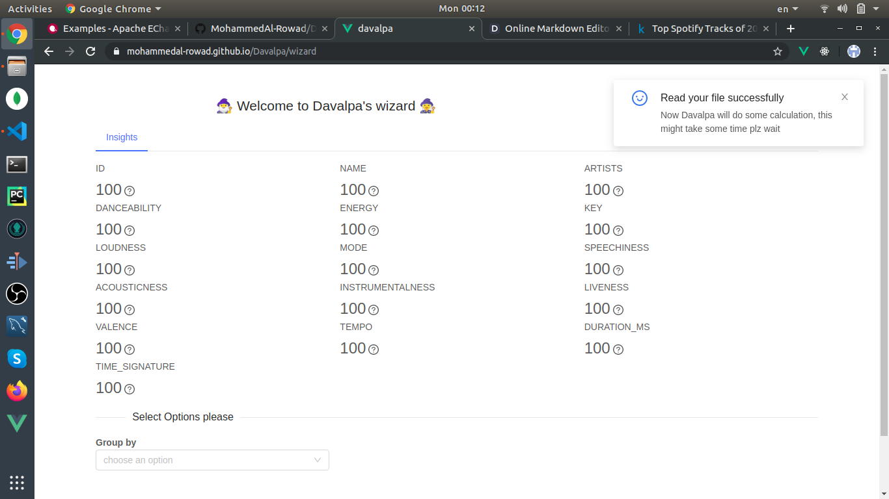
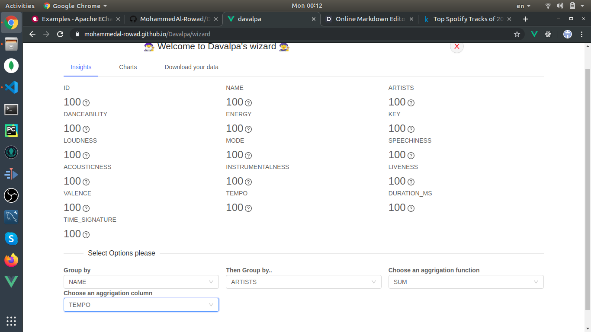
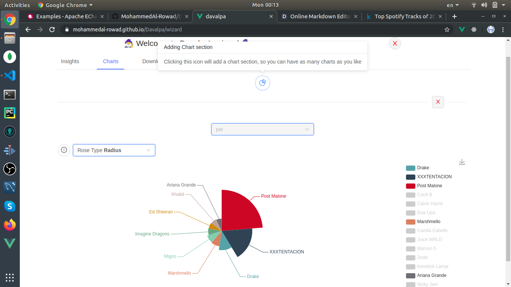
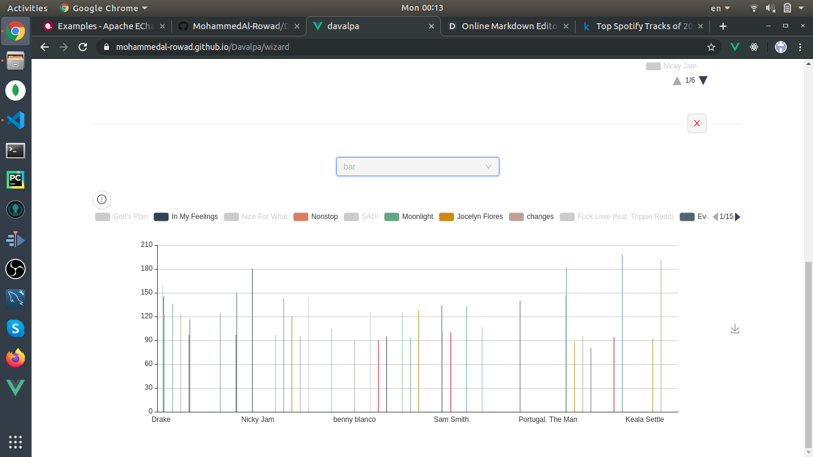
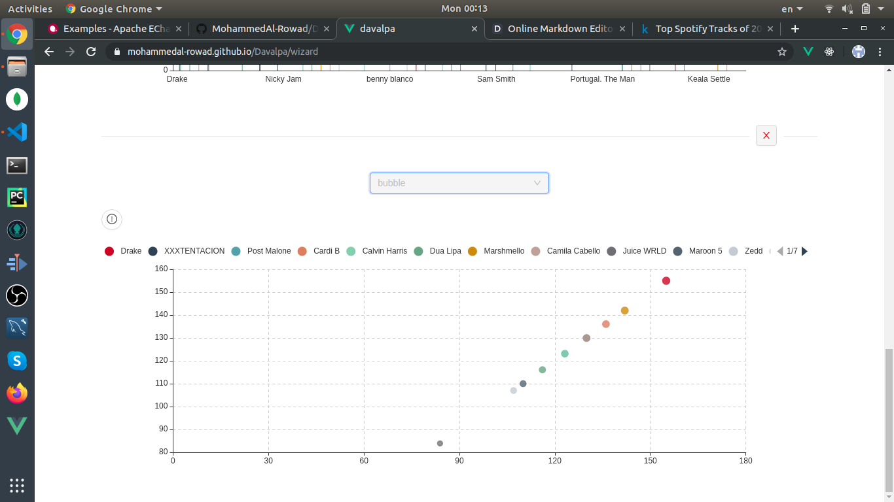
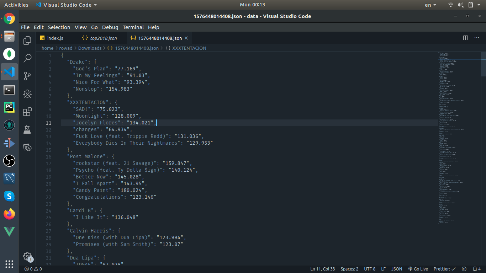

# Davalpa

I was trying to learn Vue, Vuex & PWA, so I build this small tool which takes a json file and allows you to group the data and aggregate it then you will have the ability to download the file or visualize it.

see it [here](https://mohammedal-rowad.github.io/Davalpa/)

# Tools

- [Ant Design](https://www.antdv.com/docs/vue/introduce/)
- [lodash](https://lodash.com)
- [vuejs](https://vuejs.org)
- [vuex](https://vuex.vuejs.org/)
- [echarts](https://echarts.apache.org/examples/en/)

# Install

```bash
$ git clone https://github.com/MohammedAl-Rowad/Davalpa
$ cd Davalpa
$ git checkout code
$ npm install
$ npm run serve
```

# Note

You can think of this as a POC, it will be very laggy when you try a large data sets, there is no joins and the data only shown in 2 dimensional charts

# Examples

Processing this data set https://www.kaggle.com/nadintamer/top-spotify-tracks-of-2018

After loading the data


Selecting the x/y and aggregation column


Showing a pie chart


Showing a bar chart


Showing a bubble chart


The downloaded data after being modified

